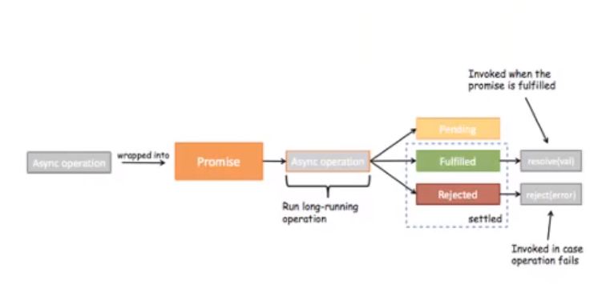

# （十八）Promise

## 18.1	什么是Promise

**简单说Promise是异步编程的一种解决方案。**

Promise是ES6中的特性。

> 什么是异步操作？

网络请求中，对端服务器处理需要时间，信息传递过程需要时间，不像我们本地调用一个js加法函数一样，直接获得`1+1=2`的结果。这里网络请求不是同步的有时延，不能立即得到结果。

> 如何处理异步事件？

对于网络请求这种，一般会使用回调函数，在服务端传给我数据成功后，调用回调函数。例如ajax调用。

```js
$.ajax({
	success:function(){
		...
	}
})
```

> 如果碰到嵌套网络请求，例如第一次网络请求成功后回调函数再次发送网络请求，这种代码就会让人很难受。

```json
$.ajax({
	success:function(){
		$.ajax({
			...
        })
	}
})
```

如果还需要再次网络请求，那么又要嵌套一层，这样的代码层次不分明很难读，也容易出问题。

## 18.2	Promise的基本使用

### 18.2.1	什么时候使用Promise？

如何解决异步请求冗余这样的问题，promise就是用于封装异步请求的。

### 18.2.2	Promise对象

```js
new Promise((resolve, reject) => {})
```
Promise对象的参数是一个函数`(resolve, reject) => {}`，这个函数又有2个参数分别是`resolve`和`reject`。这2个参数本身也是函数，是不是有点绕？后面还有回调函数`then(func)`的参数也是一个函数。

> 模拟定时器的异步事件

用定时器模拟网络请求，定时一秒为网络请求事件，用console.log()表示需要执行的代码。

```js
//1.使用setTimeout模拟嵌套的三次网络请求
setTimeout(() => {//第一次请求
    console.log("hello world")//第一次处理代码
    setTimeout(() => {//第二次请求
        console.log("hello vuejs")//第二次处理代码
        setTimeout(() => {//第三次请求
            console.log("hello java")//第三次处理代码
        }, 1000)
    }, 1000)
}, 1000)
```

一层套一层，看起是不是很绕。

使用promise来处理异步操作

```js
//参数 -> 函数
// resolve和reject本身也是函数
//then()的参数也是一个函数
new Promise((resolve, reject) => {
    setTimeout(() => {//第一次网络请求
        resolve()
    }, 1000)
}).then(() => {
    console.log("hello world")//第一次处理代码
    return new Promise((resolve, reject) => {
        setTimeout(() => {//第二次网络请求
            resolve()
        }, 1000).then(() => {
            console.log("hello vuejs")//第二次处理代码
            return new Promise((resolve, reject) => {
                setTimeout(() => {//第三次网络请求
                    resolve()
                }, 1000)
            }).then(() => {
                console.log("hello java")//第三次处理代码
            })
        })
    })
})
```

是不是觉得代码还要更复杂了？仔细看看第一个如果使用了多个就找不到对应关系了。相反第二个流程就很清楚，调用`resolve()`就能跳转到`then()`方法就能执行处理代码，`then()`回调的返回值又是一个`Promise`对象。层次很明显，只要是`then()`必然就是执行处理代码，如果还有嵌套必然就是返回一个Promise对象，这样调用就像java中的StringBuffer的append()方法一样，链式调用。

```js
new Promise((resolve, reject) => {
    setTimeout(() => {
    	resolve('success')
    }, 1000).then(success => {
    	console.log(success)
    })
})
```

setTimeout()模拟的是网络请求，而then()执行的是网络请求后的代码，这就将网络请求和请求得到响应后的操作分离了，每个地方干自己的事情。在resolve中传参了，那么在then()方法中的参数就有这个参数，例如data。

**网络请求中也会有失败情况？例如网络堵塞。**

如何处理失败情况，此时就要用到reject()

```js
new Promise((resolve, reject) => {
    setTimeout(() => {
    	reject('error message')
    }, 1000).catch(error => {
    	console.log(error)
    })
})
```

此时`reject(error)`，`catch()`方法捕获到`reject()`中的error。

> 合起来

```js
new Promise((resolve, reject) => {
    setTimeout(() => {
        // 成功的时候调用resolve()
        // resolve('hello world')

        // 失败的时候调用reject()
        reject('error message')
    }, 1000).then(success => {
        console.log(success)
    }).catch(error => {
        console.log(error)
    })
})
```

拿ajax来举例子：

```js
new Promise((resolve, reject) => {
    $.ajax({
        success:function(){
            // 成功的时候调用resolve()
            // resolve('hello world')

            // 失败的时候调用reject()
            reject('error message')
        }
    }).then(success => {
        console.log(success)
    }).catch(error => {
        console.log(error)
    })
})
```


## 18.3	Promise的三种状态



- pending:等待状态，比如正在进行的网络请求还未响应，或者定时器还没有到时间
- fulfill:满足状态，当我们主动回调了resolve函数，就处于满足状态，并会回调then()
- reject:拒绝状态，当我们主动回调reject函数，就处于该状态，并且会回调catch()


## 18.4	Promise的链式调用

1. 网络请求响应结果为 hello ,打印hello
2. 处理： hello world ,打印hello world
3. 处理： hello world，vuejs ,打印hello world，vuejs

```js
    new Promise((resolve, reject) => {
      setTimeout(() => {
        resolve('hello')
      }, 1000)
    }).then(res => {
      console.log(res)//打印hello
      return new Promise(resolve => {
          resolve(res + ' world')
      }).then(res => {
        console.log(res)//打印hello world
        return new Promise(resolve => {
          resolve(res + ',vuejs')
        }).then(res => {
          console.log(res)//打印hello world,vuejs
        })
      })
    })
```

链式调用就是`then()`方法的返回值返回一个Promise对象继续调用`then()`，此外还有简写`Promise.resolve()`。

```js
new Promise((resolve, reject) => {
      setTimeout(() => {
        resolve('hello')
      }, 1000)
    }).then(res => {
      console.log(res)//打印hello
      return Promise.resolve(res + ' world')
    }).then(res => {
        console.log(res)//打印hello world
        return Promise.resolve(res + ',vuejs')
    }).then(res => {
      console.log(res)//打印hello world,vuejs
    })
```

还可以直接省略掉`Promise.resolve()`

```js
    new Promise((resolve, reject) => {
      setTimeout(() => {
        resolve('hello')
      }, 1000)
    }).then(res => {
      console.log(res)//打印hello
      return res + ' world'
    }).then(res => {
        console.log(res)//打印hello world
        return res + ',vuejs'
    }).then(res => {
      console.log(res)//打印hello world,vuejs
    })
```

如果中途发生异常，可以通过`catch()`捕获异常

```js
    new Promise((resolve, reject) => {
      setTimeout(() => {
        resolve('hello')
      }, 1000)
    }).then(res => {
      console.log(res)//打印hello
      return res + ' world'
    }).then(res => {
        console.log(res)
        // return Promise.reject('error message')//发生异常
        throw 'error message' //抛出异常
    }).then(res => {
      console.log(res)//打印hello world,vuejs
    }).catch(error => {
      console.log(error)
    })
```

也可以通过`throw`抛出异常，类似java

```js
throw 'error message' //抛出异常
```


## 18.5	Promise的all使用

有这样一个情况，一个业务需要请求2个地方（A和B）的数据，只有A和B的数据都拿到才能走下一步。

> ajax实现

```js
$.ajax({
    ...//结果A
    resultA = true
    callback()
})
$.ajax({
    ...//结果B
    resultB = true
    callback()
})
//回调函数
function callback(){
    if(resultA&&resultB){
        ...
    }
}
```

由于不知道网络请求A和网络请求B哪个先返回结果，所以需要定义一个函数只有2个请求都返回数据才回调成功。

> Promise实现

```js
    Promise.all([
      new Promise((resolve, resjct) => {
        $.ajax({
          url: 'url1',
          success: function (data) {
            resolve(data)
          }
        })
      }),
      new Promise((resolve, resjct) => {
        $.ajax({
          url: 'url2',
          success: function (data) {
            resolve(data)
          }
        })
      }).then(results => {
        console.log(results)
      })
    ])
```

上面是伪代码，只是包装了ajax，ajaxA和ajaxB的结果都放在`resolve()`中，Promise将其放在`results`中了，使用`setTimeout`模拟。

```js
    Promise.all([
      new Promise((resolve, reject) => {
        setTimeout(() => {//  请求A
          resolve('结果A')
        }, 1000)
      }),
      new Promise((resolve, reject) => {
        setTimeout(() => {//  请求B
          resolve('结果B')
        }, 1000)
      })
    ]).then(results => {
      console.log(results)
    })
```

